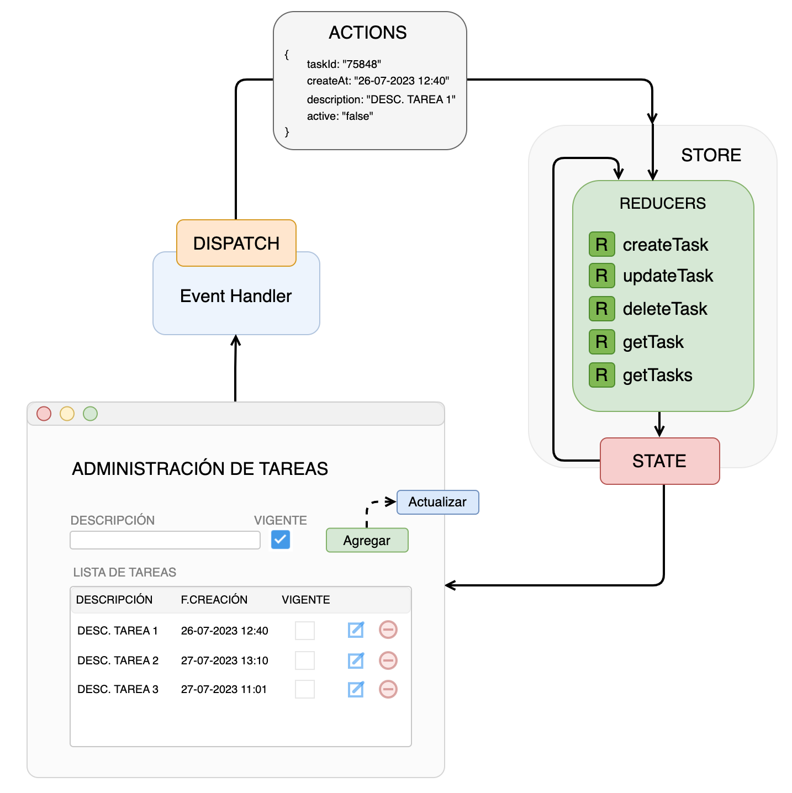

# Desafío Coopeuch Frontend

A continuación se presenta la solución (diseño e implementación) del desafío Coopeuch correspondiente al frontend. El desafío consta de una parte en el frontend y una parte en el backend que se puede encontrar en el siguiente enlace [challenge-coopeuch-backend](https://github.com/faqcodes/challenge-coopeuch-backend). El enunciado del desafío se encuentra en este [ENLACE](docs/images/challenge.png)

## Diseño

En esta parte del frontend se diseña la interfaz de usuario que permitirá la administración de las tareas. A continuación, se presenta un esquema simple de la interfaz, además de la interacción con Redux y sus Redures/Actions para el manejo de estados:



#### Disclaimer: Como esto es un diseño preliminar, es posible que la interfaz de usuario final no sea como el presentado

### Se ha optado por trabajar con RTK Query para integración con el backend. Por lo tanto, la imagen arriba no refleja el total comporatamiento de la aplicación


## Getting Started

Para la ejecución de la aplicación se deben seguir los siguientes pasos:

Clonar el proyecto desde github
```
git clone git@github.com:faqcodes/challenge-coopeuch-frontend.git

cd challenge-coopeuch-frontend
```

Instalar las dependencias
```
npm install
```

Construir la aplicación
```
npm run build
```

Ejecutar el proyecto. Se ejecutarán las pruebas de la aplicación y se desplegará en el puerto <b>5173<b>

```
npm run start
```

### La aplicación se encuentra configurada para que apunte al puerto <b>8090</b> de la aplicación backend y para que esta aplicación funcione correctamente, se debe ejecutar primero el backend

